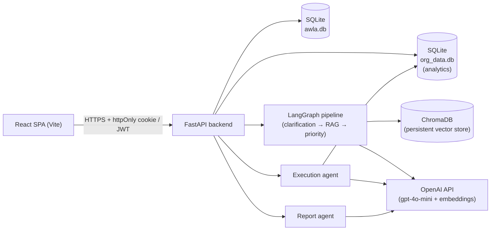

# Awla

**AI-assisted internal data-request governance.** Employees submit data/report
requests; a multi-agent LLM pipeline checks them for completeness, scores
their priority, and a manager approves, rejects, or re-prioritizes them.
Approved requests are executed into an actual report (Excel, PDF, or an
in-app dashboard), and a separate agent can summarize the whole queue into
an AI-generated meeting brief.

Originally built in a 48-hour hackathon and since hardened for real use:
authentication, a governance state machine, SQL-injection and
prompt-injection defenses, a persistent RAG pipeline, and full test/CI
coverage were all added post-hackathon.

## Table of contents

- [Problem statement](#problem-statement)
- [Solution](#solution)
- [Key features](#key-features)
- [System architecture](#system-architecture)
- [Multi-agent pipeline](#multi-agent-pipeline)
- [RAG pipeline](#rag-pipeline)
- [Tech stack](#tech-stack)
- [Folder structure](#folder-structure)
- [Installation](#installation)
- [Environment variables](#environment-variables)
- [Running the project](#running-the-project)
- [API reference](#api-reference)
- [Testing](#testing)
- [Future improvements](#future-improvements)
- [License](#license)
- [Acknowledgements](#acknowledgements)

## Problem statement

Internal data requests (a sales export, an HR report, a compliance audit)
typically arrive over chat or email with no consistent intake process. Vague
requests bounce back and forth before anyone knows what's actually needed,
and once a request *is* understood, there's no principled way to decide
what should be worked on first — priority ends up being "whoever asked
loudest" rather than something grounded in deadlines, business impact, or
policy.

## Solution

Awla gives every request a structured lifecycle:

```
submit → clarify (if incomplete) → priority score → manager decision → execution → (optional) meeting rollup
```

Each step is handled by a dedicated agent (see
[Multi-agent pipeline](#multi-agent-pipeline)), and every agent has a
deterministic, rule-based fallback — the system is fully functional even
with no LLM available, just less nuanced.

## Key features

- **Structured intake** — an agent checks each request for a time period,
  metrics, data source, and delivery format before it's allowed to proceed.
- **Grounded prioritization** — a 1–10 score derived from report type,
  deadline urgency, and organizational policy context retrieved via RAG.
- **Governance state machine** — requests move through an explicit set of
  allowed status transitions (server-enforced); a rejected request cannot
  be silently reopened.
- **Automated execution** — approved requests generate a real chart/report
  by having an agent write and run a validated, read-only SQL query against
  an analytics database.
- **Meeting rollups** — a report agent turns the current queue into an
  executive summary: overdue items, top priorities, recommendations.
- **Role-based access** — employees see and manage their own requests;
  managers see everything and hold approval/rejection/re-prioritization
  authority.
- **Works with or without an API key** — every LLM call has a deterministic
  fallback, so clarification, scoring, execution, and reporting all
  continue to function if OpenAI is unavailable.

## System architecture



The React app is the only frontend. It authenticates against the FastAPI
backend via an httpOnly session cookie (JS never touches the token
directly) and talks to a REST API under `/api/*`. The backend owns two
SQLite databases — one for users/requests/governance state, one for
synthetic organizational analytics data the execution agent queries — plus
a persistent Chroma vector store for retrieval-augmented context.

## Multi-agent pipeline

Four independent agents, each with an LLM path (`gpt-4o-mini`) and a
deterministic rule-based fallback:

| Agent | Responsibility | Triggered by |
|---|---|---|
| `clarification_agent` | Checks a request has a time period, metrics, data source, and format | Submitting or re-clarifying a request |
| `priority_agent` | Scores the request 1–10 using report type, deadline, and RAG-retrieved policy context | Automatically, right after clarification passes |
| `execution_agent` | Writes and runs a validated SQL query, returns chart data | Manager/owner running a report |
| `report_agent` | Summarizes the whole request queue into a meeting brief | Manager generating a meeting report |

`clarification_agent` and `priority_agent` are orchestrated as a
**LangGraph** state machine (with a RAG retrieval step between them);
`execution_agent` and `report_agent` are invoked directly by their own API
actions since they're independent, on-demand operations rather than part
of the intake pipeline.

Full agent responsibilities, state diagrams, and design rationale:
**[docs/ARCHITECTURE.md](docs/ARCHITECTURE.md)**.

## RAG pipeline

Priority scoring is grounded against three ChromaDB collections: curated
organizational policies, report-type requirements, and a rolling window of
real historical requests (synced from the live database, not static
examples). Retrieval uses OpenAI embeddings (`text-embedding-3-small`),
with a deterministic hashing fallback if no API key is configured, and
drops results that are relative outliers rather than blindly including
every top-K match.

Full ingestion/chunking/embedding/retrieval details:
**[docs/RAG.md](docs/RAG.md)**.

## Tech stack

**Backend**
- Python, FastAPI, Pydantic v2, Uvicorn
- SQLite (`sqlite3`, no ORM) with a hand-rolled versioned migration system
- LangGraph for pipeline orchestration
- ChromaDB (persistent) for vector retrieval
- OpenAI API (`gpt-4o-mini`, `text-embedding-3-small`)
- `python-jose` (JWT), `bcrypt` (password hashing), `slowapi` (rate limiting)
- `pandas` / `openpyxl` / `fpdf2` for Excel and PDF report generation
- `pytest` for testing

**Frontend**
- React 18, React Router, Vite
- Axios (cookie-based session auth)
- Recharts for dashboard charts
- `vitest` + `@testing-library/react` for testing

**Infrastructure**
- Docker (separate images for API and frontend; nginx serves the SPA)
- Docker Compose for local multi-container orchestration
- GitHub Actions CI (backend tests, frontend tests + build, Docker build)

## Folder structure

```
api/                 FastAPI app: routing (main.py), auth (auth.py)
agents/               clarification_agent.py, priority_agent.py,
                       execution_agent.py, report_agent.py
graph/workflow.py     LangGraph pipeline definition
rag/                   embedding.py, chromadb_client.py (retrieval)
chromadb_setup/        Builds/refreshes the Chroma vector store
data/                  database.py (users/requests), org_database.py
                       (synthetic analytics data the execution agent queries)
scripts/               create_user.py -- the only way to create an account
react-frontend/        React SPA (Vite) -- pages, components, API client
tests/                 pytest suite
react-frontend/src/**/*.test.jsx   vitest suite
docs/                  Architecture and RAG deep-dives
.github/workflows/     CI pipeline
```

## Installation

```bash
git clone https://github.com/danamaa-dev/Awla.git
cd Awla

python -m venv .venv
source .venv/bin/activate   # .venv\Scripts\activate on Windows
pip install -r requirements.txt

cp .env.example .env
python -c "import secrets; print(secrets.token_hex(32))"   # paste into SECRET_KEY
```

## Environment variables

Full documented list in `.env.example` (backend) and
`react-frontend/.env.example` (frontend). The two that matter most:

| Variable | Required | Purpose |
|---|---|---|
| `SECRET_KEY` | Yes, no default | Signs JWTs. The app refuses to start without it. |
| `OPENAI_API_KEY` | No | Enables the LLM path for all four agents. Everything still works without it, via rule-based fallbacks. |
| `ENVIRONMENT` | No (default `development`) | Set to `production` to make the auth cookie `Secure` (HTTPS-only). |
| `ALLOWED_ORIGINS` | No | Comma-separated CORS allowlist for the frontend origin(s). |
| `CHROMA_PERSIST_DIR` | No | Where the vector store persists on disk. |

## Running the project

**Backend**

```bash
uvicorn api.main:app --reload --port 8000
```

There is no demo data and no self-registration endpoint. Create your first
account:

```bash
python scripts/create_user.py
```

**Frontend**

```bash
cd react-frontend
npm install
cp .env.example .env   # VITE_API_URL, defaults to http://localhost:8000
npm run dev             # http://localhost:5173
```

**Docker (both services)**

```bash
docker compose up --build
```

> **Note on Python version:** ChromaDB's native vector-index extension was
> found, during development, to crash under Python 3.14. Python 3.11/3.12
> (chromadb's officially supported range, and what the Dockerfile uses)
> is required for RAG retrieval to actually work; on an unsupported
> version the API still runs correctly, but priority scoring proceeds
> without retrieved policy context. See
> [docs/RAG.md](docs/RAG.md#a-known-environment-limitation) for details.

## API reference

Interactive OpenAPI docs are served at `/docs` (Swagger UI) and `/redoc`
whenever the API is running. Summary:

| Method | Path | Auth | Purpose |
|---|---|---|---|
| POST | `/api/auth/login` | — | Log in, sets session cookie |
| POST | `/api/auth/logout` | — | Clears the session cookie |
| GET | `/api/auth/me` | Any | Current user profile |
| POST | `/api/requests` | Any | Submit a new request (runs clarification + priority) |
| POST | `/api/requests/{id}/clarification` | Owner/manager | Resubmit a clarified description |
| GET | `/api/requests` | Any | List requests (own, or all if manager) |
| GET | `/api/requests/{id}` | Owner/manager | Request detail |
| PATCH | `/api/requests/{id}/approve` | Manager | Approve a pending request |
| PATCH | `/api/requests/{id}/reject` | Manager | Reject a request |
| PATCH | `/api/requests/{id}/status` | Manager | Explicit status transition |
| PATCH | `/api/requests/{id}/priority` | Manager | Manually adjust priority score |
| GET | `/api/requests/{id}/charts` | Owner/manager | Chart data (JSON) |
| GET | `/api/requests/{id}/execute` | Owner/manager | Full report in the request's chosen format |
| POST | `/api/reports/meeting` | Manager | Generate an AI meeting summary |
| GET | `/api/reports/meeting/latest` | Manager | Last generated meeting summary |
| GET | `/health` | — | Liveness + DB connectivity check |

## Testing

```bash
# Backend
pip install -r requirements-dev.txt
pytest tests/ -v

# Frontend
cd react-frontend && npm test
```

Both suites run deterministically offline — the backend suite forces
`OPENAI_API_KEY` empty (every agent uses its rule-based path) and stubs
out Chroma indexing, so no network access or native-extension
compatibility is required.

## Future improvements

- Real document ingestion for the RAG knowledge base (currently curated
  policy strings) — e.g. PDF/Markdown policy documents with proper
  chunking, if the knowledge base grows beyond short discrete rules.
- Code-splitting the React bundle (currently a single ~670KB chunk).
- A Vite 5→8 upgrade to resolve a moderate dev-server-only `esbuild`
  advisory flagged by `npm audit`.
- Notifications (email/Slack) when a request changes status.
- Pagination on the backend list endpoint itself (the frontend paginates
  client-side today).

## License

All rights reserved — see [LICENSE](LICENSE). This is a source-available
portfolio/product repository, not an open-source project: the code is
public for demonstration and review purposes, but no rights are granted
to use, copy, modify, or redistribute it. Contact the copyright holders
for licensing inquiries.

## Acknowledgements

Built by **Danah Ateeq**, **Amira Alshahrani**, and **Folwa Kuttbi**,
originally over a 48-hour hackathon, now under active post-hackathon
development.
