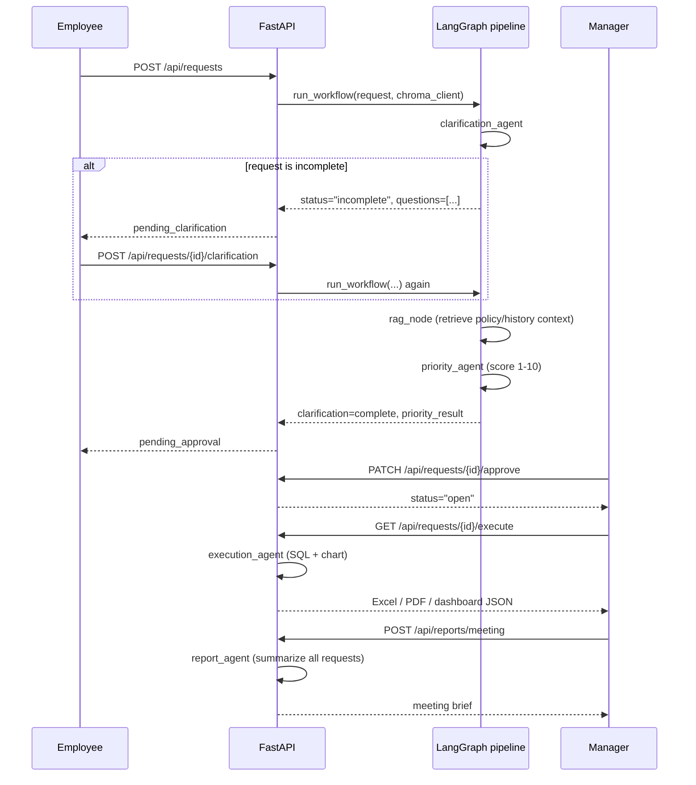
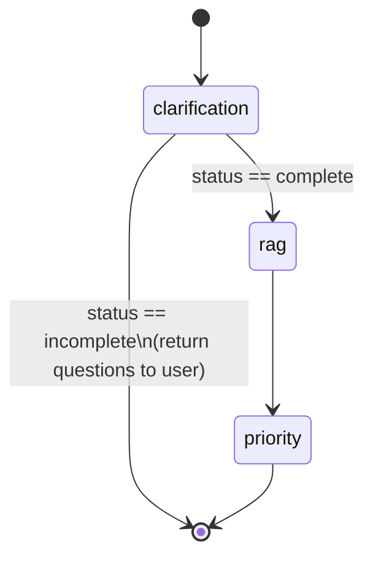
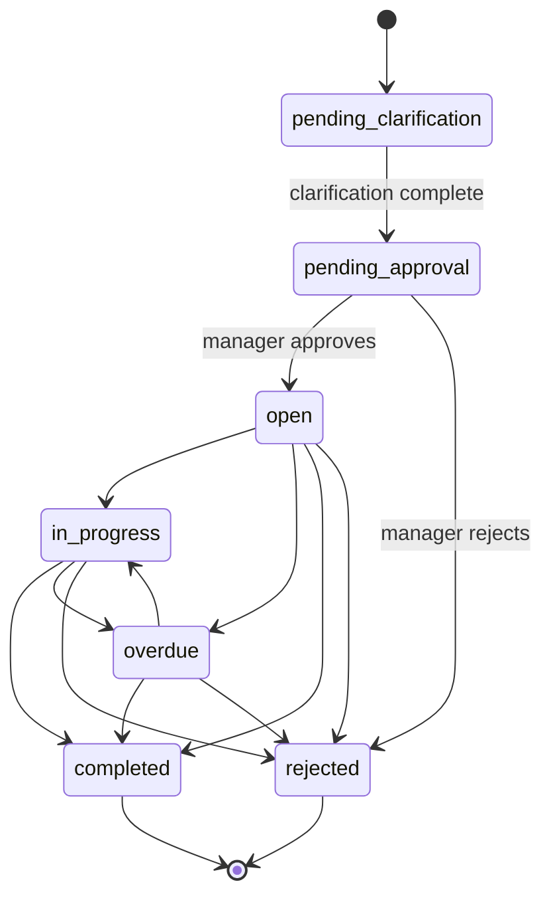

# Architecture

This document covers the request lifecycle, the multi-agent pipeline, the
governance state machine, and the reasoning behind each design choice. For
setup instructions see the [README](../README.md); for the retrieval
pipeline specifically see [RAG.md](RAG.md).

## Request lifecycle, end to end

## Multi-agent pipeline

### Why a multi-agent design at all

Each stage of the lifecycle needs a different kind of judgment: "is this
request specific enough to act on," "how urgent is this relative to
everything else," "what data actually answers this," and "what should a
manager focus on this week" are four distinct problems with different
inputs, different failure modes, and different consumers. Splitting them
into four agents keeps each one small, testable in isolation, and
independently swappable (e.g. the execution agent's SQL-writing logic can
change without touching how priority is scored).

### Agent responsibilities

| Agent | File | Input | Output | LLM | Fallback |
|---|---|---|---|---|---|
| Clarification | `agents/clarification_agent.py` | title, description, department, report type, deadline | `{status: complete\|incomplete, questions: [...]}` | `gpt-4o-mini`, temperature 0 | Keyword check for time period / metrics / data source / minimum length |
| Priority | `agents/priority_agent.py` | request details + RAG context | `{score: 1-10, recommendation, reasons, rag_references}` | `gpt-4o-mini`, temperature 0 | Additive rubric: report-type weight + deadline urgency + aging |
| Execution | `agents/execution_agent.py` | an approved request | validated SQL, chart type, chart data | `gpt-4o-mini`, temperature 0 | Fixed SQL template chosen by report-type keyword match |
| Report | `agents/report_agent.py` | all non-pending requests | summary, overdue items, top priorities, recommendations, workload insight | `gpt-4o-mini`, temperature 0 | Aggregate arithmetic over the request list |

**Every agent follows the same pattern**: try the LLM call first; on any
exception (missing key, network error, malformed JSON), log it and fall
through to a deterministic rule-based function. This means the system is
never fully down because of an LLM outage — quality degrades gracefully
instead.

### Orchestration: LangGraph for the intake half only

`clarification → rag → priority` (`graph/workflow.py`) is the one part of
the system with a genuine conditional branch: an incomplete request skips
retrieval and scoring entirely and returns immediately with follow-up
questions. LangGraph is used here specifically because that branch is
real, and because keeping it as an explicit graph (rather than a chain of
`if` statements) makes it straightforward to extend later — a retry loop
after clarification, or a human-in-the-loop checkpoint — without
restructuring the flow.

`execution_agent` and `report_agent` are deliberately **not** part of this
graph. Each runs from its own independent API action (running a report,
generating a meeting summary) with no clarification or priority step
involved — folding them into the graph would add indirection with no
orchestration benefit.

The graph is compiled once at import time (`_COMPILED_WORKFLOW` in
`graph/workflow.py`), not per-request, and the Chroma client used by the
`rag` node is built once at API startup and passed in explicitly as a
parameter — it does not rely on being stashed inside the request payload.

### Memory and state

There is no persistent conversation memory or agent-to-agent message
passing beyond the single `RequestState` dict threaded through the graph
for one request's lifecycle (`request`, `chroma_client`, intermediate
results). Each agent call is stateless and idempotent given the same
inputs; all durable state (status, score, history) lives in SQLite, not in
the agents themselves.

### Tool usage

The only "tool" an agent has beyond producing structured JSON is the
execution agent's ability to run a SQL query it writes — and that
capability is deliberately constrained: the returned SQL is validated
against an allowlist (single `SELECT`/`WITH` statement, known tables only,
no DDL/DML keywords) before it's ever executed, and the connection itself
is opened read-only. See `agents/execution_agent.py` for the validator.

## Governance state machine

Every transition is validated server-side against this explicit table
(`ALLOWED_TRANSITIONS` in `data/database.py`) before being applied — a
`rejected` or `completed` request cannot be silently reopened, and the
clarification endpoint refuses to act on a request that isn't actually
`pending_clarification`. This closes what was, during hardening, a real
bug: a request could previously be flipped back to `open` after being
rejected, with no validation at all.

## Backend request handling

FastAPI routes are synchronous (`def`, not `async def`) throughout, which
is intentional: every downstream call (SQLite, the OpenAI SDK, Excel/PDF
generation) is blocking, and Starlette runs sync handlers in a threadpool
automatically — using `async def` here without also switching every
downstream call to an async equivalent would silently block the event
loop instead of helping.

Authentication accepts either an httpOnly session cookie (the React app)
or a plain `Authorization: Bearer` header (scripts, tests, `curl`) —
both are checked by the same dependency in `api/auth.py`.
