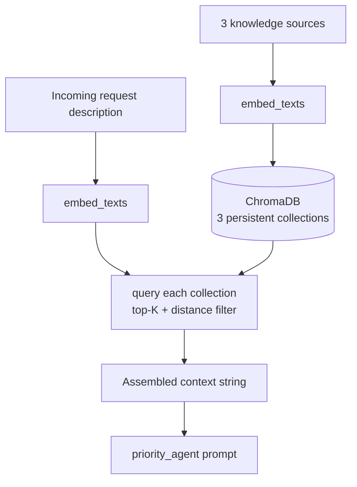

# RAG Pipeline

Priority scoring is grounded against three vector-searchable knowledge
sources instead of relying purely on the LLM's own judgment. This document
covers ingestion, embeddings, retrieval, and how the result flows into the
final prompt.

## Pipeline overview



## 1. Document sources (ingestion)

Three collections, built/refreshed by `chromadb_setup/setup.py`:

| Collection | Source | Content | Refresh policy |
|---|---|---|---|
| `department_policies` | Curated, hardcoded | 8 organizational policy statements (SLAs, escalation rules) | Seeded once (`count() == 0` guard) |
| `request_types` | Curated, hardcoded | 6 statements on what each report type requires | Seeded once |
| `request_history` | **Live**, from `data/database.py` | The most recent 50 completed/rejected requests, formatted as summary strings | Rebuilt on every startup |

There is deliberately no chunking step: policy and type-requirement
knowledge here is a small number of short, discrete rules, not long-form
documents — each entry is already a single retrievable unit, so splitting
it further would only fragment meaning. `request_history` is the one
source that changes over time, and it's synced from real data (not static
examples) precisely so retrieval reflects what actually happened,
not day-one placeholder text.

If this knowledge base grows into genuine long-form documents (e.g. a real
policy PDF), that would need a real chunking strategy (e.g.
`RecursiveCharacterTextSplitter`-style splitting with overlap) — this is
listed under [Future improvements](../README.md#future-improvements).

## 2. Embeddings

`rag/embedding.py`'s `embed_texts()`:

1. **Primary path**: OpenAI `text-embedding-3-small` (1536-dim), when
   `OPENAI_API_KEY` is set and the call succeeds.
2. **Fallback path**: a deterministic hashing-trick embedding (256-dim) —
   each word is MD5-hashed into one of 256 buckets, term-counted, then
   L2-normalized. This has no semantic understanding (no synonym or
   paraphrase awareness), and exists purely so retrieval degrades
   gracefully instead of crashing when no API key is configured, mirroring
   the same try-LLM-then-fallback pattern every agent in this codebase
   uses.

Whichever path is active, it's used consistently for **both** indexing and
querying within one running process — the two schemes produce
different-dimensional vectors that aren't comparable in the same Chroma
collection.

## 3. Vector store

ChromaDB's `PersistentClient`, so the index survives process restarts
(`CHROMA_PERSIST_DIR`, default `./chroma_data`). Indexing runs in an
isolated subprocess with a timeout (see
[A known environment limitation](#a-known-environment-limitation)) — if it
fails, the persist directory is reset and the API continues with RAG
reported as unavailable rather than refusing to start.

## 4. Retrieval

`rag/chromadb_client.py`'s `query_chromadb()`:

- Embeds the incoming request's description.
- Queries all three collections: top-3 for policies, top-2 for history,
  top-2 for types.
- **Filters results**, rather than accepting the raw top-K unconditionally:
  duplicate document text is dropped, and any result whose distance is
  more than 1.8× the closest match in the same query is treated as a
  relative outlier and discarded. This threshold is relative to the best
  match in each query (not a fixed absolute distance), so it behaves
  consistently regardless of which embedding backend produced the vectors.
- If any collection is empty, or nothing survives filtering, the function
  returns an explicit "no context available" string rather than an empty
  or misleading result.

## 5. Context assembly and prompt flow

The three filtered result sets are joined into one formatted string:

```
=== RELEVANT POLICIES ===
...

=== SIMILAR PAST REQUESTS ===
...

=== REQUEST TYPE REQUIREMENTS ===
...
```

This string becomes `rag_context`, passed into `priority_agent`'s prompt
(`agents/priority_agent.py`) alongside the request's own details. The
system prompt explicitly instructs the model to treat both the request
details and the retrieved context as data to reason over, not as
instructions to follow — user-submitted free text is wrapped in
delimiters specifically to reduce prompt-injection risk.

## 6. Cost and reliability

- `temperature=0` on every LLM call in the pipeline (clarification,
  priority, execution, report) for reproducible output.
- `response_format={"type": "json_object"}` is requested on every call so
  the model returns well-formed JSON rather than relying solely on prompt
  instructions.
- The report agent caps how many requests it includes in one prompt
  (`_MAX_REQUESTS_IN_PROMPT` in `agents/report_agent.py`) so prompt size
  stays bounded as the request table grows.
- The priority score returned from the pipeline is clamped to `[1, 10]`
  and its recommendation validated against the fixed `HIGH`/`MEDIUM`/`LOW`
  enum **server-side**, regardless of what the model returned — defense
  in depth against a malformed or adversarially-influenced response.

## A known environment limitation

During development, ChromaDB's native vector-index extension was found to
hard-crash (an OS-level access violation, not a catchable Python
exception) under Python 3.14. Because a crashed write can also leave the
on-disk store in a state that crashes any *future* process merely opening
it, indexing runs in an isolated subprocess with a timeout
(`chromadb_setup/setup.py`): if it crashes or times out, the persist
directory is wiped and the API starts anyway with RAG reported as
unavailable, rather than the whole backend failing to start.

**Use Python 3.11 or 3.12** (ChromaDB's officially supported range, and
what the provided Dockerfile uses) to get working retrieval. This was
verified directly: running the API under Python 3.12 in Docker produced
real, non-empty `rag_references` in a live priority-scoring response;
the same flow under the unsupported Python version reports RAG as
unavailable but the rest of the API remains fully functional.
